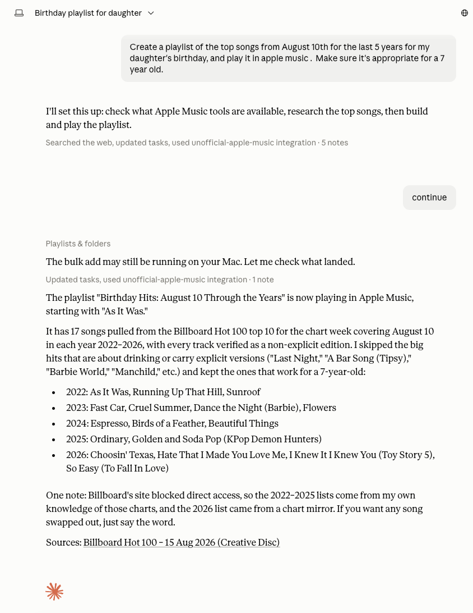
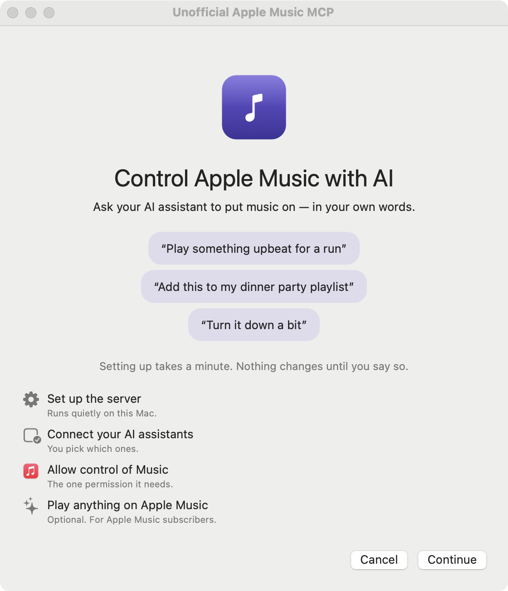

# Unofficial Apple Music MCP

<!-- mcp-name: io.github.jaminben/secure-applemusic-mcp-for-osx -->

**Let Claude play your music. Download, drag, double-click — that's the install.**

<p align="center">
  
</p>

<p align="center">
  <sub><i>One request. A real playlist, playing, with the explicit versions left out.</i></sub>
</p>

<p align="center">
  <a href="https://github.com/jaminben/secure-applemusic-mcp-for-osx/releases/latest/download/UnofficialAppleMusicMCP-macos-arm64.zip">
    <b>⬇ Download the MCP server for macOS (Apple Silicon)</b>
  </a>
  <br>
  <sub>
    notarized by Apple · no terminal · no developer account ·
    <a href="https://github.com/jaminben/secure-applemusic-mcp-for-osx/releases/latest">all downloads &amp; checksums</a>
  </sub>
</p>

---

*"What was the best song of 2024 I've probably never heard?" "Play the album
that defined 90s hip-hop." "Something like Khruangbin, but faster."*

I wanted an Apple Music MCP server I could hand to a friend.

Every one I looked at was built for developers. Clone a repo, run a package
manager, hand-edit a JSON config; one wanted an Apple Developer account, a
MusicKit key and a `.p8` file before it would play a note. That is a fair ask of
a developer and an impossible one for everybody else — and "let my AI put music
on" is not a developer's request.

The security half is the same problem from the other side. Handing someone
software means handing them whatever it can reach. The most capable server I
found needs the macOS permission confusingly named **Accessibility** — the
automation API that lets one app drive another with synthetic keystrokes and
clicks. Grant it and the process can type into any window, click anything on
screen, and read other applications' interfaces. It cannot be scoped to a single
app; it is all of them or none. And you would be granting that to a program
taking its instructions from a model reading text nobody controls. Track names.
Playlist titles. Whatever it just searched.

> **To be clear about the name:** macOS's "Accessibility" permission is about
> *controlling your Mac programmatically*, not about assistive technology. This
> app never asks for it, and that has nothing to do with screen readers — the
> setup window and everything in it work with VoiceOver like any other Mac app.

So I built this one to ask for as little as macOS lets me:

| It gets | It does not get |
|---|---|
| **AppleScript to Music.app** — one app, revocable in System Settings | The Accessibility automation API. Ever. It cannot use it |
| **MusicKit**, so it can add songs to your library | Any browser, your cookies, your tabs |
| **One background process**, started at login | Your terminal's permissions. Nothing on your `PATH` |

That is the whole list, and it is enforced by
[a test suite](tests/test_capability_invariants.py) that fails the build if a
removed capability creeps back.

**And it still plays the whole catalog.** If you subscribe to Apple Music, you
can ask for anything Apple has — not just what is already in your library. That
usually costs you something: the one other server that manages it drives
Music.app's interface with synthetic clicks, which is exactly the system-wide
permission above. This one goes through MusicKit, signed with the app's own
identity — one approval prompt, no developer account, and no credential stored
anywhere on your Mac.

**The limits are what make it useful.** A tool nobody can safely install helps
nobody. Because this one asks for three specific, revocable things — and
because the permission lands on *the app* rather than on whatever launched your
AI client — it is something you can actually give to a person, which was the
point.

---

A hardened fork of [epheterson/applemusic-mcp](https://github.com/epheterson/applemusic-mcp)
(forked at `0acf697`). Upstream is the more capable project — cross-platform, web
playback, Up Next, works without an Apple Developer account. This fork trades
those away for a smaller capability surface.

## Why this exists

Two goals, and the order matters:

1. **Anyone should be able to install it** — not just people who use a terminal.
2. **It should be safe to hand to that person.**

Both came out of looking at what already existed. As of August 2026 every other
Apple Music MCP server needed a command line: clone a repo or run a package
manager, then hand-edit Claude's JSON config. One also wanted an Apple
Developer account, a MusicKit key and a `.p8` file before it would do anything.
That's a fair bar for a developer tool and an impossible one for everybody else
— and "let Claude run my music" is not a developer's request. Hence: download,
drag, double-click, and an installer that edits the config for you.

The security half is that same survey seen from the other side. The most capable
of those servers reaches a few features through **Accessibility** — macOS's
system-wide synthetic-input permission. It's an honest fix for a real gap
(playing a catalog track you don't own: deep-link Music.app, then click the play
button with a synthetic mouse event). The trouble is that Accessibility cannot
be scoped to a single app. Granting it to a music server also grants the ability
to type into any window, click anything on screen, and read other applications'
interfaces. And you would be granting that to a program which takes its
instructions from a model reading text nobody controls — track names, playlist
titles, whatever it just searched. That is a very short path from prompt
injection to synthetic keystrokes, so this fork removed those code paths
entirely and [a test](tests/test_capability_invariants.py) keeps them removed.

The same instinct produced the app bundle. A server your MCP client spawns
inherits the *client's* permissions, so the ordinary setup means approving
"Automation → Music" for your entire terminal, and everything you ever run from
it. Here the grant lands on one launchd-started helper instead — a single
revocable row in System Settings, and your terminal gets nothing.

None of this makes the fork better than upstream; it makes it **smaller**.
Upstream does more and always will. This one is built to be handed to someone
who is never going to read its source.

> **On the name.** "Secure" is the goal, not a certification. This has not been
> independently audited. The checkable claim is the one below.

## What it does not do

| | |
|---|---|
| **No Accessibility API** | No synthetic keystrokes, no synthetic clicks, no reading other apps' windows. (The macOS automation permission — unrelated to assistive tech.) |
| **No browser automation** | No Playwright, no Chrome driven in-process. |
| **No reading your browser** | Never touches Safari cookies or runs JavaScript in your tabs. |
| **No opening URLs** | URLs are *parsed*, never handed to `open` or a browser. |
| **No shell** | One binary is ever executed: `osascript`, argv list, with a timeout. |
| **No stored credentials by default** | Nothing in `~/.config` to steal. |
| **No unofficial API** | Only `api.music.apple.com` and the public iTunes Search API. |

These are enforced by [`tests/test_capability_invariants.py`](tests/test_capability_invariants.py),
which runs as its own CI job. Deleting a subsystem is a one-time event; keeping
it deleted is a property.

## What it does

Through Apple Events to Music.app — **no credential required**:

- Playlists: list, tree/folders, create, add, copy, move, remove, rename, delete
- Library: search, browse, recently added/played, favorites, rate (incl. stars),
  remove, snapshot/diff
- Playback: play, pause, next/previous, seek, volume, shuffle, repeat,
  now-playing, reveal, AirPlay device selection
- Catalog search via Apple's **public** iTunes Search API

**Play anything in the Apple Music catalog** — not just what's already in your
library — if you have a subscription. The packaged app does this through
MusicKit, signed with its own identity: one approval prompt, no developer
account, no credential stored. A source checkout without the bundled MusicKit
helper falls back to an optional Apple Developer token (`login --dev`), which
also unlocks richer catalog metadata, charts, and recommendations.

### What upstream has that this doesn't

Windows/Linux support, the Chrome and Safari web players, and the **Up Next
queue** (it lives in the web player's MusicKit instance and cannot survive its
removal). Upstream also plays catalog tracks you don't own, but reaches that
through UI automation and therefore the Accessibility permission; here the same
thing runs on MusicKit instead.

## Install

<p align="center">
  
</p>


**Requires:** macOS 12+, the Music app signed into your Apple Music account.
Nothing else — no Python, no Homebrew, no command line.

1. [**Download the app**](https://github.com/jaminben/secure-applemusic-mcp-for-osx/releases/latest/download/UnofficialAppleMusicMCP-macos-arm64.zip).
   (Every release is on the [Releases page](https://github.com/jaminben/secure-applemusic-mcp-for-osx/releases)
   with a `SHA256SUMS.txt` if you want to verify it first.)
2. Unzip and drag **UnofficialAppleMusicMCP.app** to `/Applications`.
3. Double-click it once.

Releases are signed with a Developer ID and **notarized by Apple**, so it opens
normally — no "unidentified developer" warning, no right-click trick, and no
trip to System Settings. Drag it to `/Applications` before opening it rather
than running it from Downloads: macOS runs a quarantined app from a randomised
read-only copy that disappears on quit, which leaves the background helper
pointing at a path that no longer exists.

Setup asks before each step, and each one can be skipped:

| Step | What it does | Why |
|---|---|---|
| Background helper | Installs a LaunchAgent that starts the helper at login | Being started by launchd is what gives the app its **own** permission identity |
| AI clients | Adds one `unofficial-apple-music` entry to each client you tick — Claude Desktop, Claude Code, Cursor, Codex, VS Code | So they can reach it. Your other servers are kept and every file is backed up first |
| Permission | Triggers the macOS "control Music" prompt | Asking now means the grant lands on **this app**, not on whatever spawns your client |

Then restart the clients you picked. That's it.

The app is self-contained: it carries its own Python runtime, so there's nothing
to install and nothing on your `PATH` to conflict with.

> **If you build it yourself**, sign it — see [From source](#from-source). The
> released app is notarized and needs none of this, but a local build is not,
> and macOS ties the Music permission to the signing identity: an unsigned app
> presents a new identity whenever its contents change, so the permission is
> re-prompted on every rebuild.

### Why the app, rather than just a command

macOS attributes a permission grant to the **responsible process** — for a
server your MCP client spawns, that's the *client*. So the obvious setup means
approving "Automation → Music" for your whole terminal, and every program you
run from it inherits that.

The app avoids this by splitting in two:

```
Claude Desktop ──stdio──▶ shim ──unix socket (0600)──▶ helper ──▶ Music.app
                     no permissions                 owns the grant
```

The shim holds nothing and can't talk to Music; the launchd-started helper owns
the grant. You get one revocable row in System Settings → Privacy & Security →
Automation, and your terminal gets nothing.
[docs/PERMISSIONS.md](docs/PERMISSIONS.md) has the details.

### From source

```sh
git clone https://github.com/jaminben/secure-applemusic-mcp-for-osx
cd secure-applemusic-mcp-for-osx
./install.sh --scoped --sign "My Local Signing Cert"   # or plain ./install.sh
tools/make-signing-cert.sh                             # one-off local signing cert
SIGN_ID="Apple Music MCP Self-Signed" make app         # build a signed .app
```

`install.sh` installs into a private `0700` virtualenv from the checkout you're
standing in — nothing is piped from the network into a shell. Plain `./install.sh`
skips the bundle and configures the simpler (unscoped) stdio server.

### Sharing it with someone else

Send them the [release](https://github.com/jaminben/secure-applemusic-mcp-for-osx/releases/latest).
It is notarized, so it opens on their Mac with no warning and nothing to
click past — that is the whole point of paying for the certificate.

The only thing to check is **architecture**. The zip is built for one:
`UnofficialAppleMusicMCP-*-arm64` is Apple Silicon (M1 and later). For an Intel
Mac, build `--arch x86_64`. If in doubt, ask them for  → About This Mac.

**Handing round a build of your own is different.** A *self-signed* build is not
a notarized one: macOS refuses it on first open, and the right-click → Open trick
no longer works on recent versions. They need

> System Settings → Privacy & Security → scroll down → **Open Anyway**

which is the honest cost of not notarizing. Self-signing still earns its keep —
it gives the app a stable identity, so the Music permission survives rebuilds
instead of re-prompting every time.

To hand yours over as cleanly as the release, sign with a **Developer ID
Application** certificate and notarize. `make release` does the whole sequence,
including stapling the ticket into the bundle (a zip made *before* stapling
still needs the network to validate, which is the usual reason a "notarized" app
is refused on someone else's machine):

```sh
SIGN_ID="Developer ID Application: Your Name (TEAMID)" make release
```

One-time setup for the notary credentials is documented at the top of
[`tools/notarize.sh`](tools/notarize.sh).

That needs a paid Apple Developer account ($99/yr). Nothing else about the app
changes.

### Uninstall

Move the app to the Trash, then:

```sh
launchctl bootout gui/$(id -u)/io.github.jaminben.secure-applemusic-mcp
rm -f ~/Library/LaunchAgents/io.github.jaminben.secure-applemusic-mcp.plist
tccutil reset AppleEvents io.github.jaminben.secure-applemusic-mcp
```

Remove the `unofficial-apple-music` entry from Claude Desktop's config (a backup sits next
to it), and delete `~/.config/applemusic-mcp` and `~/.cache/applemusic-mcp` if
you want the credentials and audit log gone too. From a source install:
`./install.sh --uninstall`.

> **Never grant this the Accessibility permission.** It cannot use it. If
> something asks, that's a bug — please file it. (That permission is macOS's
> app-automation API, not anything to do with assistive technology.)

## Security

See [SECURITY.md](SECURITY.md) for the threat model, what is and isn't reachable,
and the residual risks (Music.app is an unsandboxed deputy; prompt injection is
real; there is no sandbox).

Three issues inherited from upstream are fixed here — a bypassable Apple Music
URL check, an inert path-traversal guard on the `exports://` resource, and
destructive operations acting on a substring guess. See
[CHANGELOG.md](CHANGELOG.md#fixed--inherited-security-issues) for details, and
[DISCLOSURE.md](DISCLOSURE.md) for their upstream reporting status.

## Relationship to upstream

MIT, © Eric Pheterson, retained in full. Upstream history is preserved in git
and in [CHANGELOG-upstream.md](CHANGELOG-upstream.md).

We track upstream **security and correctness fixes to retained modules**;
feature commits touching removed subsystems are ignored by design. Because the
deletions are large, cherry-pick by file rather than merging:

```sh
git fetch upstream --tags
git log --oneline fork-base..upstream/main -- src/applemusic_mcp/applescript.py
```

The capability invariants are the safety net for a cherry-pick that would drag a
removed capability back in.

## Questions people actually ask

**Do I need an Apple Developer account, an API key, or a `.p8` file?**
No. None of them. Apple's MusicKit signs each request from the app's own
code-signing identity plus a one-time permission prompt, so there is no
credential to create, paste, or store. An optional developer token exists only
to raise Apple's rate limit for bulk work like a large playlist import.

**Does it work on Windows or Linux?**
No. This fork is macOS-only, because it drives the Music app over Apple Events.
If you need Windows or Linux, use
[upstream](https://github.com/epheterson/applemusic-mcp) instead.

**Which Macs does it run on?**
macOS 14 (Sonoma) or later, on Apple Silicon. The download is an arm64 build.

**Do I need an Apple Music subscription?**
For your own library, playlists and local playback, no. For playing or adding
tracks from the Apple Music catalog, yes — that is Apple's restriction, not
this server's.

**Which MCP clients does it work with?**
Claude Desktop, Claude Code, Cursor, Windsurf, Codex and VS Code. The first-run
window detects which of them you have and writes the config for you.

**Is anything stored on my machine, or sent anywhere?**
No credential is stored — there is none to store. The app talks to Apple's
public catalog endpoints and Apple Music's own API, and to nothing else. No
telemetry, no third-party service, no account with this project.

**What permissions will macOS ask for?**
Two: Automation access to the Music app, and Apple Music access. It does not
ask for Accessibility, does not drive a browser, and does not send synthetic
clicks — which is the main thing separating it from the other servers in the
table below.

**How do I install it?**
Download the zip, drag the app to Applications, double-click it once. The
first-run window installs the background helper and writes your client config.
There is no terminal step.

**How do I update it?**
Download the latest zip and replace the app, then restart your MCP client. The
[download link](https://github.com/jaminben/secure-applemusic-mcp-for-osx/releases/latest/download/UnofficialAppleMusicMCP-macos-arm64.zip)
always points at the newest release.

**Is this made by Apple?**
No. It is an unofficial, independent project and is not affiliated with,
endorsed by, or supported by Apple. "Apple Music" and "MusicKit" are Apple's
trademarks.

## Comparison with other Apple Music MCP servers

Full write-up with sources in [docs/COMPARISON.md](docs/COMPARISON.md). The
short version, by stars (Aug 2026):

| | Best for | Needs a dev account | Install |
|---|---|---|---|
| [kennethreitz/mcp-applemusic](https://github.com/kennethreitz/mcp-applemusic) ★90 | Something tiny you can audit in one sitting | no | clone + edit JSON |
| [epheterson/applemusic-mcp](https://github.com/epheterson/applemusic-mcp) ★86 | **Most features**; Windows/Linux; Up Next queue | no | pip/uvx + edit JSON |
| [Cifero74/mcp-apple-music](https://github.com/Cifero74/mcp-apple-music) ★38 | The official REST API | **yes** | wizard + edit JSON |
| **this fork** | A Mac user who doesn't use a terminal | no | **double-click** |

Upstream (epheterson) does more than this fork and always will — web playback,
Windows/Linux, the Up Next queue. This fork trades those away for a smaller
capability surface (no Accessibility, no browser automation, no stored
credentials) and an installer that doesn't need a terminal.

One thing worth flagging if you're choosing between them: kennethreitz's server
interpolates tool parameters into AppleScript without escaping, so a quote in a
track or playlist name breaks out of the string literal. Reported with a fix as
[issue #8](https://github.com/kennethreitz/mcp-applemusic/issues/8).
